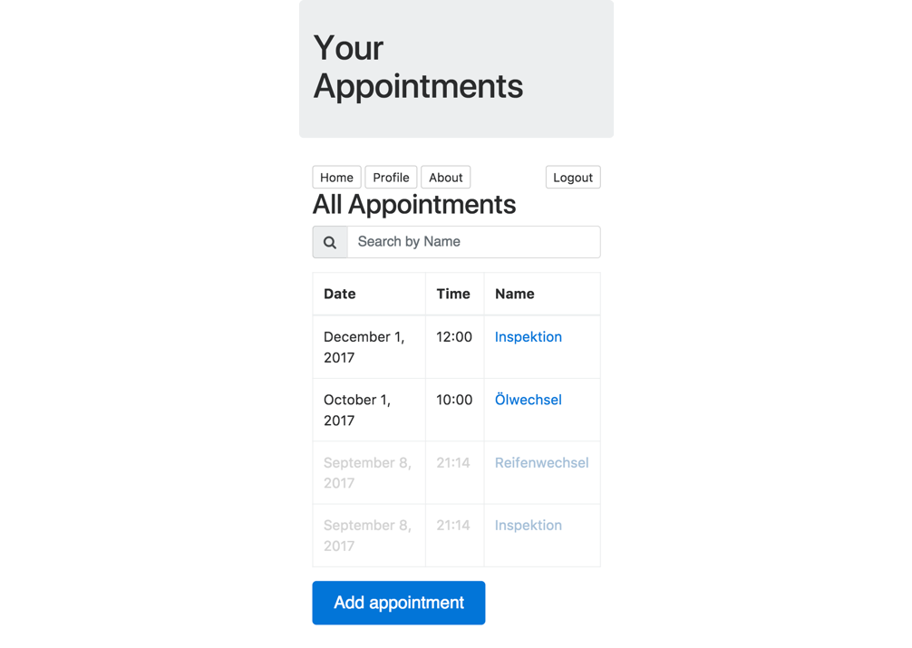

# Appointments

  
#### Features 

- Angular 4 Frontend Application generated with [Angular CLI](https://github.com/angular/angular-cli) version 1.3.2.
- Data mocked in `/src/app/in-memory-data.service.ts` OR
- Data fetched from Firebase database
- Search appointments by name (`/src/app/search.pipe.ts`)
- Appointments `orderBy` date (`/src/app/order-by.pipe.ts`)
- Past appointments are grayed out with `[ngClass]="{…}"`
- Add new appointment
- Application is deployed on [Firebase](https://firebase.google.com/)

## Angular CLI commands

- Run `npm install` initially.
- Run `ng s -o` for a dev server.
- Run `ng g component component-name` to generate a new component. You can also use `ng g directive|pipe|service|class|guard|interface|enum|module`.
- Run `ng build` to build the project. The build artifacts will be stored in the `dist/` directory. Use the `-prod` flag for a production build.
- Run `ng test` to execute the unit tests via [Karma](https://karma-runner.github.io).
- Run `ng e2e` to execute the end-to-end tests via [Protractor](http://www.protractortest.org/). Before running the tests make sure you are serving the app via `ng serve`.
- [Angular CLI README](https://github.com/angular/angular-cli/blob/master/README.md)

## Firebase Deploy

Project must already be set up on [https://console.firebase.google.com](https://console.firebase.google.com)

- `firebase login`
- `ng build -prod`
- `firebase deploy`
- `firebase open hosting:site`
